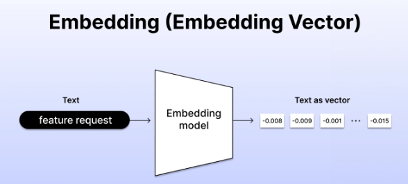
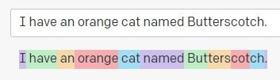
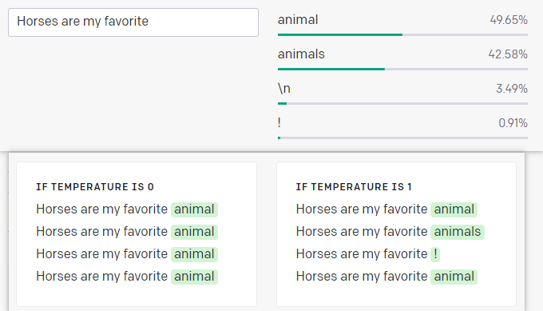

# chatgpt api를 사용해보자 - documentation
- https://platform.openai.com/docs/introduction
- GET 

# Introduction
## Overview
- OpenAI의 API는 언어와 코드를 이해하고 생성하는 어떠한 업무에도 적용 가능 함
- 이미지 수정, 생성도 되고 STT도 됨
- fine-tune도 가능 함

### Resources
- playground도 있고
- API reference도 있고
- help center도 있고
- 현재 API status도 있고
- 포럼, 사용정책도 있음

## Key concepts
- GPT는 코드와 일반 언어를 이해할 수 있게 학습되어있음
- 입력에 반응해서 text outputs를 제공 함. 이게 completion
- 이 때 입력은 prompts라고 불림
- GPT는 코드 생성, 요약, 대화, 글쓰기 등 다양한거 할 수 있음

### Embeddings
- Embedding은 text같은 데이터 조각의 벡터 representation임
- text를 실수 벡터 형태로 표현한 결과물을 의미
- 
- 서로 다른 단어들로부터 추출된 embedding들 간의 거리를 계산하여 의미적 관계를 파악할 수 있음
- 데이터의 내용과 의미를 보존하기 위한 벡터 재표현 정도?
- 비슷한 데이터 덩어리는 서로 가까운 embeddings를 갖는 경향이 있음
- text를 입력으로 가지고, embedding vector를 출력으로 생성하는 embedding모델을 제공 함

### Tokens
- GPT랑 embedding model은 token이라는 덩어리로 text를 처리함
- 예를 들어 tokenization은 token과 ization으로 나뉨
- 1 token은 거의 4characters이거나 0.75 words임. 영어에서
- prompt나 generated output은 model's maximum context length보다 짧아야 함
- 

---

# Quickstart
- cutting-edge language model을 써서, text를 만들고 이해하기에 좋음
- API로 이 모델에 접근 가능
- 여기선 키 컨셉 배울 수 있음
  - content generation
  - summarization
  - classification, categorization, sentiment analysis
  - data extraction
  - translation

## Introduction
- completions endpoint는 API의 핵심임
- input으로 prompt 주면, API는 completion을 줌

1. Start with an instruction
2. Add some examples
3. Adjust your settings
4. Build your application

- temperature가 0보다 크면, 같은 질문에 대해 다른 답변 줌
- 0에 가까우면 리스크는 적고, 1에 가까울수록 답변이 다양해 짐
- 

### pricing
- 돈 내면 되고

### Closing
- sing API request는 오직 4,096 tokens까지 처리 가능

---

# Libraries
- python, node.js 라이브러리 제공 함

# Models
- GPT-3은 이제 레거시임, GPT-4가 최신

# Deprecations
- 버전업 계속 하고 있음

# Tutorials

# Poilicies

---
