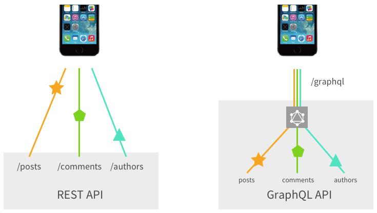

# graphql이란?
- gql이라고 부름
- sql이랑 마찬가지로 쿼리 언어지만 차이가 큼
- sql은 db에 저장된 데이터를 효율적으로 가져오는게 목적
- gql은 클라가 데이터를 서버로부터 효율적으로 가져오는게 목적
- 그래서, sql은 보통 백엔드에서, gql은 보통 클라에서 작성 및 호출

## 왜 rest api 안쓰고 gql 씀?
- 내가 원하는 데이터만 쏙쏙들이 뽑아 쓰고 싶음(overfetching안하고 데이터에 8가지 중 3가지만)
- 두 번에 걸쳐서 데이터를 받아오는게 아니라, 한 번에 받아오고 싶음(underfetching)

## codegen
- graphql schema, operations를 자동으로 생성해 줌
- `yarn graphql-codegen`

## .graphqlrc
- 여기서 codegen이 어떻게 생길지 정의 해 줌

## 구조
- mysql은 database 안에 바로 table
- graphql은 database 안에 schema 안에 table

## 자동 코드 생성 codegen
- `yarn graphql-codegen`