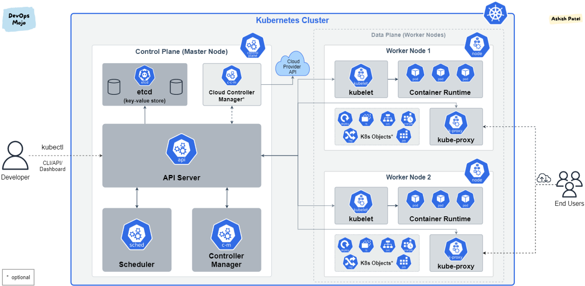

# 쿠버네티스란?
- ㅇㅇ

## 역사
- 컨테이너 가상화 기술은 서비스간에 자원 격리하는데 OS가 필요 없음
- 그 컨테이너들을 배포하고 운영하는 역할을 하는게 컨테이너 오케스트레이터(쿠버네티스)
- 쿠버네티스는 여러 업체들이 참여해서 노하우를 녹여냄

## 쿠버네티스 쓰면 좋은 점
- 오토스케일링은 당연함
- 쿠버네티스는 오토힐링 기능이 있어서 서버가 장애나도 새로 만들어줌
- 쿠버네티스는 디플로이먼트로 자동 배포 됨

## vm과 컨테이너 차이
- 둘 다 서버 안에 os(host) 있다.
- vm엔 os(host)안에 하이퍼바이저 있고, 하이퍼바이저가 os(guest) 여러개 관리
- 컨테이너는 os안(host)에 컨테이너들이 여러개 있음.
- vm은 각 os(guest)별로 다 분리되어 있어서 한os가 침범당해도 다른건 못건드림
- 컨테이너는 한 컨테이너가 뚫려서 os(host)에 접근가능해지면 다른 컨테이너도 위험해짐

## 쿠버네티스의 pod
- 컨테이너에는 한 개의 모듈만 담아
- pod에는 컨테이너를 담고, 이 한 pod가 배포의 단위다
- 내가 필요한 pod만 확장 가능

## 쿠버네티스 대시보드
- 실제에선 해킹위협때메 대시보드 쓰지마

## 쿠버네티스 3개 패키지
- kubeadm: the command to bootstrap the cluster.
- kubelet: the component that runs on all of the machines in your cluster and does things like starting pods and containers.
- kubectl: the command line util to talk to your cluster.

## 설치
https://kubernetes.io/docs/setup/production-environment/tools/kubeadm/install-kubeadm/
```shell
sudo apt-get update
sudo apt-get install -y apt-transport-https ca-certificates curl
sudo curl -fsSLo /usr/share/keyrings/kubernetes-archive-keyring.gpg https://packages.cloud.google.com/apt/doc/apt-key.gpg
echo "deb [signed-by=/usr/share/keyrings/kubernetes-archive-keyring.gpg] https://apt.kubernetes.io/ kubernetes-xenial main" | sudo tee /etc/apt/sources.list.d/kubernetes.list
sudo apt-get update
sudo apt-get install -y kubelet kubeadm kubectl
sudo apt-mark hold kubelet kubeadm kubectl
```

## 서비스와 파드
- 서비스를 통해 파드에 접근함

## 쿠버네티스 구조
- 서버 1대는 마스터로 쓰고, 나머지는 node로 씀. 한 마스터에 여러 노드들이 연결 됨
- 이게 하나의 쿠버네티스 클러스터임.
- 마스터는 쿠머네티스의 전반적인 기능 컨트롤. 노드는 자원 제공.
- 클러스터 전체 자원 늘리고싶으면 노드 추가하면 됨
- 클러스터 안에 네임스페이스가 쿠버네티스 오브젝트들을 독립된 공간으로 분리되게 해 줌
- 네임 스페이스에는 파드들이 있음. 이 파드들을 외부에서 접근가능하게 하는게 서비스.
- 서로 다른 네임스페이스들은 연결 불가(a네임스페이스의 서비스가 b네임스페이스의 파드에 접근 불가)
- 파드 안에는 여러 컨테이너가 있음
- 파드에 문제 생기면 데이터 날라가니까, 볼륨을 만들어서 데이터는 볼륨에 저장함. 파드 날라가도 데이터 남아있음
- 네임스페이스에 자원 양 한정시킬수있음(ResourceQuota, LimitRange) cup 메모리 제한
- 파드의 컨테이너 안에 환경변수 설정(ConfigMap, Secret)
- 컨트롤러가 파드들을 관리해 줌. 종류가 다양함

- 
## 쿠버네티스 컨트롤러
- Replication Constroller나 ReplicaSet이 가장 기본적인 컨트롤러로 파드 죽으면 다시 살려줌, 파드 갯수 늘리고줄이고 가능
- deployment 컨트롤러 > 배포 후에 파드들을 새 버전으로 업그레이드 해 줌. 문제 생기면 롤백 쉽게 해 줌
- 데몬셋 컨트롤러는 한 노드에 파드가 하나씩만 유지가 되게 해 줌. 이렇게 해야하는 모듈들이 있다.
- 크론잡. 특정 잡만하고 종료할 때 사용. 그런 잡을 주기적으로 할 떄 사용

## 쿠버네티스 마스터노드
- 는 cpu최소가 2코어여야 한다.

## 쿠버네티스 파드
- 라벨 key:value
- type:web, lo:dev, type:db, lo:production 등
- 한 파드 내의 컨테이너a와 b의 포트는 달라야 함

## 쿠버네티스 노드 스케쥴
- memory : 초과 시 pod 종료
- cpu : 초과 시 낮춤. 비종료

## 쿠버네티스 서비스
- 서비스의 ip를 통해서 파드에 접근
- 왜 굳이 파드ip로 안가고, 서비스를 통해서 가냐?
- 파드는 서비스장애 등등으로 죽을 수 있는데, 죽으면 ip가 변함
- 서비스는 사용자가 직접 지우지않으면 삭제안됨. 그래서 서비스 씀
- 서비스 종류 다양함
  - 클러스터ip(가장기본) : 쿠버네티스 클러스터 내에서만 접근 가능. 외부에서 접근 불가 
    - 운영자, 내부 대쉬보드, pod 서비스 상태 디버깅 때 사용
  - 노트포트 : 모든 노드에 포트가 할당되어 노드로 접속하면 서비스로 연결되고 서비스에서 노드 안의 포드로 연결됨
    - 내부망 연결, 일시적외부연결 등. 외부에 간단한 데모 보여줄 때
  - 로드밸런서 : 외부에서 로드밸런서에 접근하고, 로드밸런서가 노드에 트래픽 분산해줌. 별도의 외부에서 접속 가능한 ip 지원 플러그인이 있어야 함
    (GCP 등은 이미 제공 해줌)
    - 외부 시스템 노출 용