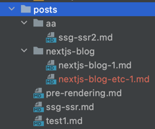
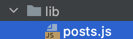
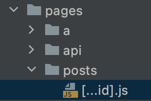
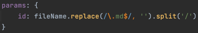
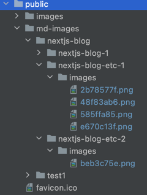

# posts에 포스트가 늘어나면 폴더로 관리하는게 좋을 것 같다는 생각이 들었다

## 원하는 폴더 구조
  

posts폴더 안에  
aa폴더 안에 md파일들,  
nextjs-blog 안에 md파일들  
이 있으면 좋겠다.  

바꿔야 할 부분 :  
  
posts.js에서 md파일을 조회할 때 폴더명은 제외하고 불러와야 한다. 폴더 안에 있는 md파일을 조회해야 함  

  
[id].js 를 [..id].js로 바꿔야  
path를 posts/test1 뿐만 아니라, posts/aa/ssg-ssr2  
경로까지 인식할 수 있다.  

또한, id를 넘겨줄 때  
  
['aa', 'ssg-ssr2']  
이렇게 넘겨줘야 한다.

[catch all routes 부분 참고](https://nextjs.org/docs/routing/dynamic-routes)

또한, public 부분에서도 이미지 관리를 체계적으로 했다.  
  