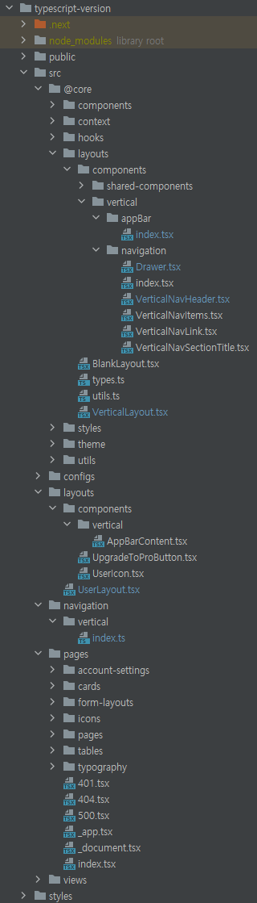

# nextjs에서 mui를 적용해보자

## 설치하기
```shell
npm install @mui/material @emotion/react @emotion/styled
```

## dashboard 템플릿을 적용해보자
- https://mui.com/store/items/materio-mui-react-nextjs-admin-template/ 
- 요기 materio 테마가 맘에 듬

## materio 구조 분석하기

- 전반적으로 ```src/@core```에서는 건드리지 않아도 됨
### Main
- 결국 pages폴더의 내용이 main으로 들어가게 됨
- _app.tsx 안에 Layout을 넣어 놓고,
- 이 Layout안에서 컨텐츠는 {children}으로 받고,
- Pages안에 있는 Dashboard, Accout Settings, icons를 
- ```MainContentWrapper(layout-content-wrapper)```의 ```ContentWrapper(layout-page-content)```안에서
- 갈아 끼워 줌

### appbar
- 최상단 영역. 검색창 있고, 우측에 사용자 아이콘 있음
- ```layouts/components/vertical/AppBarContent.tsx```에 있음
- ```@core/layouts/components/vertical/navigation/VerticalNavHeader.tsx```에 로고 있음

### nav drawer
- 네비게이션 영역
- 최상단에 로고 있는데, VerticalNavHeader임
- 얘네는 ```@core/layouts/components/vertical/navigation```쪽에 많음
- 최하단 ```afterVerticalNavMenuContent```는 ```navigation/index.ts```에 있음


### 기타
- ```configs/themeConfig.ts```에선 템플릿 설정(로고 옆 이름, 다크모드)등 설정 가능


## hydration 에러
- react 17버전에선 문제가 없다가, 18버전으로 넘어오면서
- a태그 안에 div태그가 있는 것 때문에 hydration에러가 나옴
- 기본적으로 a태그는 인라인, div태그는 블록 요소 임
- 그래서, a태그 안에 div를 넣는게 일단 안되지만
- 그래도 들어갈 순 있지
- 여튼 수정 완료

## prop `style` did not match. Server: "null" Client: "pointer-events"
- 서버는 null인데, 클라는 pointer-events여서 에러 남
- 서버와 클라의 style이 달라서 생기는 문제임
- _documents를 수정해주면 된다는데..
- build하고 실행하면 에러는 안 남

## Property getLayout does not exist on type 에러
- 이 에러 났다가 안났다가 함..;
- ```next.d.ts```파일 있으면 안 남
