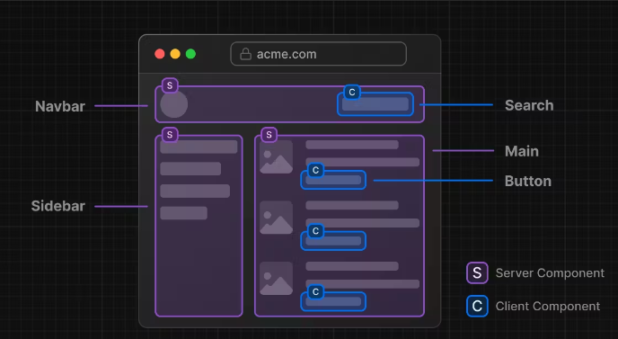

# nextjs 13 버전 시작
- 13버전이 나온지 좀 됐으니 또 안해볼 수 없지
- 이전에 썼던 pages router로도 되고, 새로 나온 app router로도 됨

## nextjs 설치
Node.js 16.8 이상 필요
```shell
npx create-next-app@latest # 자동으로 ts로 설치 됨
```

## docs 따라해보기
- https://nextjs.org/docs

---

# Getting Started - Introduction
## What is Next.js?
- nextjs는 웹앱 만드는 프레임워크
- react components를 사용해서 ui만들 수 있음
- 추가적인 structure, features, optimizations 제공
- bundling, compiling 등의 툴을 자동으로 구성해주고 추상화 함
- nextjs 짱짱 좋음

## Main features
- Routing : 파일 시스템 기반 라우터. layouts, nested routing, loading states, error handling 등을 함
- Rendering : client-side, server-side 렌더링 함.
- Data Fetching : async/await을 지원하는 data fetching 가능
- Styling : CSS 지원
- Optimization : image, font, script optimization 해 줌
- TypeScript : TS지원
- API Reference : API 업데이트 됨. 확인해봐

## Pre-Requisite Knowledge
- 초보자 친화적으로 docs 제작
- HTML, CSS, React는 선행으로 필요

---

# Installation
- pages directory, index.tsx, _app.tsx, _document.tsx는 옵션인데 안해도 됨
- public 폴더도 옵션. images, fonts 등 저장. URL /로 접근 가능
```shell
run npm dev
```

---

# Project Structure
- Next.js
  - next.config.js : Nextjs 설정 파일
  - middleware.ts : middle ware
  - instrumentation.ts : OpenTelemetry and Instrumentation
  - .env : environment variables
  - .next-env.d.ts : TS 선언 파일
- Ecosystem
  - package.json : Project dependencies and scripts
  - .gitignore : git ignore
  - tsconfig.json : TS 설정 파일
  - .eslintrc.json : ESLint 설정 파일
- top-level
  - app : app router
  - pages : pages router
  - public : static
  - src : optional application source folder
- Dynamic Routes
  - [folder] : Dynamic route segment
  - [...folder] : Catch-all segments
  - [[...folder]] : Optional catch-all segments

---

# React Essentials
- Server Components와 같은 React의 새로운 feature과 친해져야 Nextjs개발할 때 좋다
- Server Component와 Client Component 비교할거임
- 추천되는 pattern도 볼거임

## Server Components
- 기존 전통적인 server rendering의 성능을 향상시키면서 client-side app에서의 상호작용을 결합 함?
- 뭐 하여튼 좋아진단 얘긴데


## Thinking in server component
- React가 UI를 만드는 방법에 대한 생각을 변화한것 처럼, React Server component는 server와 client를 레버리지 하는 
  하이브리드 앱을 만드는 새로운 mental model 소개한다
- React가 전체 application을 렌더링하는거 말고 목적에 맞는 렌더링을 선택할 수 있게 해 줌

- 상호작용이 없는 ui는 서버 컴포넌트로, 있는 ui는 클라이언트 컴포넌트로 렌더링 하면 됨

## Why Server Components?
- React의 강력함과 유연성이 있으면서도 PHP같이 돌아가게 느끼게 해 줌
- Server component가 있으면 첫 페이지 로딩이 빠름
- 처음엔 모든 component가 server component인데, 'use client'써서 client component로 사용 하면 됨

## Client Components
- client component는 client-side의 상호작용을 할 수 있게 해 줌
- nextjs에서 얘네는 server에서 pre-rendered되고, client에서 hydrated됨
- 그냥 맨 위에 'use client'만 써주면 client-component가 됨

## when to use server and client components
- client component의 경우로 쓰기 전까진 server component로 쓰면 됨


## Patterns
- client component를 나무의 나뭇잎으로 보내라. performance 향상을 위해
- 모든 layout을 client component로 만들지 말고, server component 안에 부분만 client component로 해라

## Composing Client and Server Components
- server component와 client component는 같은 component tree에서 combine 될 수 있음
- 서버에서 react는 client에 결과물 보내기 전에 모든 server component를 렌더링 함
- client component 안의 server component도 포함
- client component는 일단 스킵
- 클라이언트에서 react는 server component의 렌더링된 결과에서 client component와 slots를 렌더링 함
- client component 안에 있던 server component는 그 내용이 교체 됨

## Nesting Server Components inside Client Components
- client component 안에 server component를 넣는 방법은
- client component 파일 안에서 server component를 import해서 쓰는 방식이 아니라
- client component의 children으로 server component를 전달하는 방식으로 써야 함
- 이런 방식은 passed prop이 독립적으로 렌더링되게 해 줌

## Passing props from Server to Client Components (Serialization)
- server component로부터 client component로 보내지는 props는 serilizable해야 함
- 즉, functions, Dates 등은 바로 못 넘김

## Keeping Server-Only Code out of Client Components (Poisoning)
- js모듈은 server와 client에서 공유가 되긴 해서
- server에서만 실행되게 의도된 코드도 client에서 실행이 된다
- 그래서, server에서만 가져올 수 있는 데이터(ex. process.env.API_KEY)는 client에선 empty string이 됨
- 이럴 때는 server에서만 동작되게 해줘야 함

## The "server only" package
```shell
npm install server-only
```
- import 'server-only'가 들어가있는 파일을 import하는 client component는 에러 뜸

## Data Fetching
- 특별한 이유가 없는 한, fetching data는 server component에서 하는걸 권장 함

## Third-party packages
- third-party packages들은 'use client'를 uesState를 사용하는 자신들의 코드에 넣기 시작 함
- npm의 많은 packages들이 아직 'use client'를 안 넣어놔서 문제가 됨
- 예를 들어 `<Carousel />`은 client에서 동작하는 코드라 너의 'use client'를 써놓은 client component에서 쓰면 
  문제가 없음
- 근데 너의 server component에서 쓰면 문제가 되니까,
```javascript
carousel.tsx
'use client'

import { Carousel } from 'acme-carousel'

export default Carousel
```
- 이렇게 wrap해서 써라. 근데 server component에서 쓰지 않고 보통 너의 client component에서 쓸거니까
- 굳이 wrap안해서 써도 될 듯 하지만 한가지 예외인 부분은 provider components임.
- 얘네는 react state나 context에 의존하면서 root of application에서 쓰이기 때문에 좀 조치가 필요 함
- 몇몇 bundler는 'use client'를 지울수도 있다는것에 주목하는것은 가치가 있다

## Context
- data share를 위해 context 많이 씀
- context는 server component에서 사용 불가
- 그래서 server component에서도 data를 share하는 대안에 대해서도 알아볼거임
- 우선 root에서 context provider 사용하는 법은
```javascript
theme-provider.tsx
'use client'
 
import { createContext } from 'react'
 
export const ThemeContext = createContext({})
 
export default function ThemeProvider({ children }) {
  return <ThemeContext.Provider value="dark">{children}</ThemeContext.Provider>
}
```
- 이걸 만들고 얘를 root에서 import해서 써

## Rendering third-party context providers in Server Components
- 이것도 Context랑 비슷한 방식으로 넣으면 됨

## Sharing data between Server Components
- server component는 interactive하지 않고, react state 못 읽음
- 대신, native js patterns로 여러 server component에서 접근 함
```javascript
import { db } from '@utils/database'
 
export async function UsersLayout() {
  let users = await db.query()
  // ...
}
```
- db를 이렇게 사용하는게 global singletons라고 불림

## Sharing fetch requests between Server Components
- fetch한 data를 page나 layout 등 다양한 곳에서 접근하고 싶음
- props로 넘기고받고 하지 말고
- data를 사용하는 component와 함께 data fetching을 배치하는 것을 추천 함
- 여러 component에서 같은 data를 fetch하면 nextjs가 자동으로 cache함