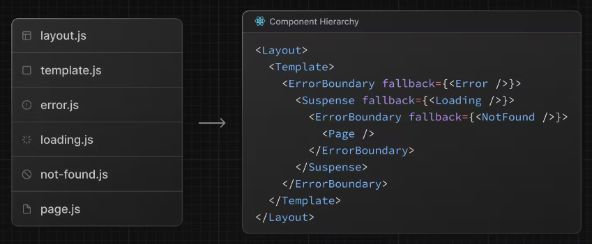

# Building Your Application

# Routing Fundamentals
- 모든 app의 기본은 routing

## Terminology
- Tree: A convention for visualizing a hierarchical structure. For example, a component 
tree with parent and children components, a folder structure, etc.
- Subtree: Part of a tree, starting at a new root (first) and ending at the leaves (last).
- Root: The first node in a tree or subtree, such as a root layout.
- Leaf: Nodes in a subtree that have no children, such as the last segment in a URL path.

## The app Router
- shared layouts, nested routing, loading states, error handling 등의 다양한 것들을 지원하는
- server component에서 동작하는 app router
- pages 대체
- 기본적으로 app 내의 component는 server component임. client component도 쓸 수 있음

## Roles of Folders and Files
- file-system에 기반한 router 사용
- 폴더가 path 역할을 하고, 폴더 안에는 page.tsx가 존재

## File Conventions
- layout : Shared UI for a segment and its children
- page : Unique UI of a route and make routes publicly accessible
- loading : Loading UI for a segment and its children
- not-found : Not found UI for a segment and its children
- error	Error : UI for a segment and its children
- global-error : Global Error UI
- route : Server-side API endpoint
- template : Specialized re-rendered Layout UI
- default : Fallback UI for Parallel Routes

## Component Hierarchy
- layout.js
- template.js
- error.js (React error boundary)
- loading.js (React suspense boundary)
- not-found.js (React error boundary)
- page.js or nested layout.js

## Colocation
- app 디렉토리의 폴더 안에 page나 route가 아닌 style 등의 파일을 같이 넣을 수도 있음
- page와 route만 public하게 주소를 가져서 외부 접근이 가능 함

## Server-Centric Routing with Client-side Navigation
- client-side rendering을 하는 pages 방식과 달리
- app 방식은 server-centric routing을 함
- 이 때, server component와 data fetching on the server 로 진행 함
- 라우팅은 server-centric이지만, router가 client-side navigation(Link component도 쓰고)을 사용 함
- 무슨 의미냐면, 사용자가 새 라우터로 이동하면 브라우저가 전체 페이지 리로드 안하고, 변하는 부분만 갈아 끼움

## Partial Rendering
- `/dashboard/settings` and `/dashboard/analytics` 형제 routes 간에 이동할 때, 바뀌는 부분만 렌더링 함
- 오가는 데이터 양을 줄이고, 실행 시간을 줄이고, 성능을 향상 시킴

## Advanced Routing Patterns
- parallel routes
- intercepting routes
- 얘네들 쓰면 더 다양한 복잡한 UI만들 수 있음

---

# Defining Routes
- Next.js 앱에서 routes를 정의하고 조직하는걸 알려 줌

## Creating Routes
- file-system 기반 route 함
- page.js 만 publicly accessible 함

---

# Pages and Layouts