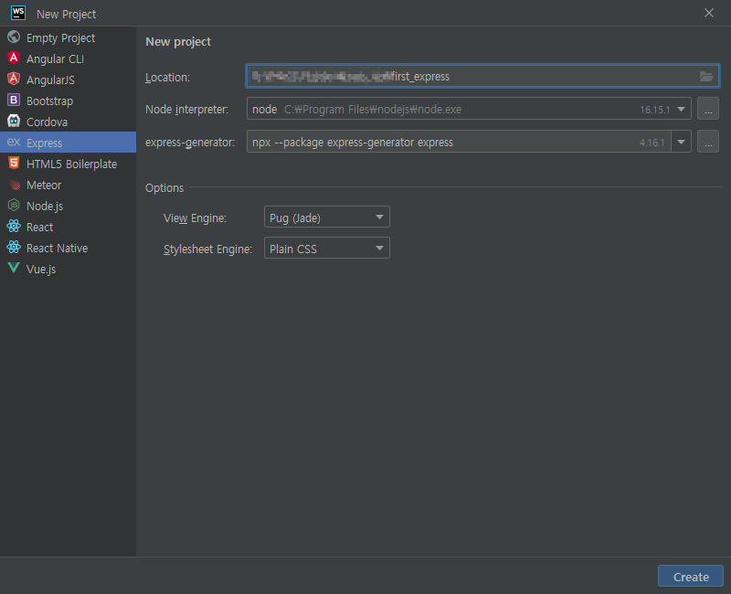

# 노드js 개발을 위해 알아야 할 것

### nvm
nvm은 node version manager  
[nvm 깃헙](https://github.com/nvm-sh/nvm) 에서 설치 가능

```shell
curl -o- https://raw.githubusercontent.com/nvm-sh/nvm/v0.39.1/install.sh | bash
source ~/.bashrc
nvm ls
nvm install --lts # lts최신 버전 설치 v16.15.1
nvm use 16 # v16.15.1 사용
```

npm은 node package manager

package.json의 scripts안의 start, dev가 있다고 할 때,  
start는 npm start로 해주면 되고,  
dev는 npm run dev로 해줘야 한다.  

nvm start, stop, restart, test는 기본적으로 설정되어있는 애들이라 run 안 붙여도 됨  

## nodemon
nodemon으로 코드 변경되는거 바로 적용 가능  
```shell
npm install -g nodemon
nodemon
```

___

## webstrom에서 express 시작
  


## 프로젝트 이전과 관련하여 기존 것과 새 것 비교

### 생성된 폴더&파일
/bin /bin/www  
/node_module  
/public /public/images /public/javascripts /public/stylesheets/style.css  
/routes /routes/index.js /routes/users.js  
/views /views/error.pug /views/index.pug /views/layout.pug  
app.js  
package-lock.json  
package.json

### 다른 부분
/component  
/config  
/extensions  
/log  
/models  
/src  
/tesseract  
.eslintrc  
.prettierrc  

### 내용이 같은걸 확인한 부분
/bin/www  
/app.js  약간 다르지만 거의 같음  

## PM2 사용하기
```shell
npm install -g pm2
pm2 start www
```

## 포트 변경해서 npm start하기
```shell
SET PORT=5000 && npm start # window
export PORT=5000 && npm start # ubuntu
```

## npm install 에러 발생
- 설치하려는 패키지a:1.0.0이랑, 패키지b:2.0.0이 있는데, 이 패키지b에서 패키지a:0.0.5를 사용하면 문제 됨
- npm7부터 이거 에러로 잡음
- --force : package-lock.json에 몇가지의 다른 의존 버전들을 추가한다?
- --legacy-peer-deps : peerDependency가 맞지 않아도 일단 설치한다?
- 여튼 force로 하는게 맞긴 한듯한듯한 느낌
- 