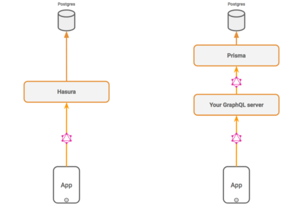

# prisma란?
- nodejs랑 ts를 위한 ORM
- JDBC나 SQLAlchemy 같은 애임
- 좋다고 함.

## 사용하기
https://www.youtube.com/watch?v=PWuvaxa78kw
```shell
npx create-react-app aa
npm i
npx prisma init
npx prisma migrate dev
npx prisma studio
npm run dev
```
- 만약, ```prisma @prisma/client```가 안생기면 직접 만들어줘
```shell
npm install prisma @prisma/client
```

- init하면 prisma 폴더랑, .env파일 생김
- .env파일 가서 DATABASE_URL="postgresql://id:ps@localhost:5432/db?schema=myschema"
- 요렇게 바꾸자
- 그리고, ```schema.prisma```가서 model 만들어줘

## 버전 에러
- node v16.17.1로 하면 [에러 남](https://github.com/prisma/prisma/issues/14834)
- node v16.15.1로 하자

## prisma vs hasura
- graphql 엔진
- graphql api로 쓸 수 있음. 얘가 api서버처럼 작동
- prisma는 서버에 붙여서 씀


